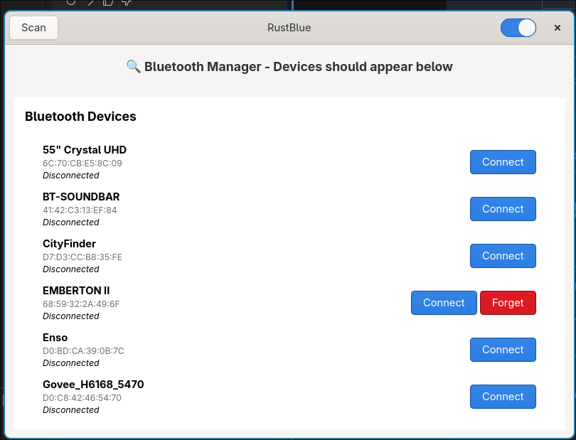
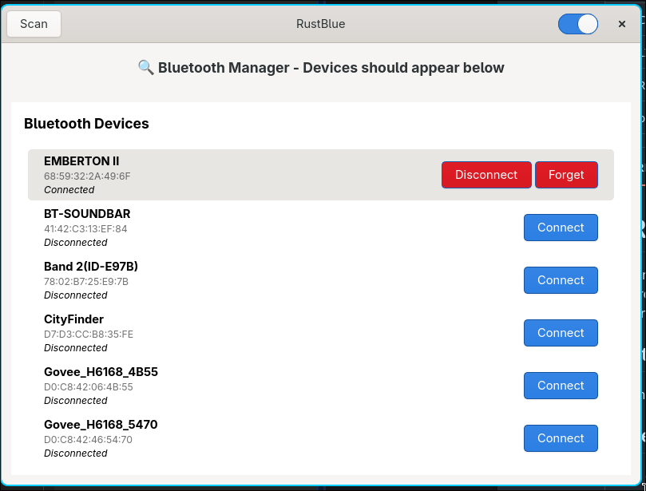

# RustBlue: Rust GTK4 Bluetooth Manager

need a better look bluetooth GUI that can run in fedora hyprland under wayland.


A modern Bluetooth management application written in Rust using GTK4, inspired by the original [Blueman](https://github.com/blueman-project/blueman) project. This application provides a native desktop experience for managing Bluetooth devices on Fedora Linux.



The application has been successfully implemented and is ready for use on Fedora Linux systems.
the binary should be able to run in any linux

## Quick Start

### Prerequisites

The following system packages are required (automatically installed via the "Install Dependencies" task):

```bash
sudo dnf install -y gtk4-devel libadwaita-devel dbus-devel bluez-libs-devel
```
```bash
sudo apt install -y libdbus-1-dev libglib2.0-dev libgirepository1.0-dev libgdk-pixbuf2.0-dev libpango1.0-dev libgraphene-1.0-dev libgtk-4-dev libadwaita-1-dev pkg-config
```

### Building and Running

   ```bash
   cargo build        # Build the project
   cargo run          # Build and run the application
   cargo check        # Check for errors without building
   ```

Installation

```bash
cargo build --release
sudo cp target/release/rustblue /usr/local/bin/
```

or take the binary from release

### Hyprland config
```bash
windowrule = float, title:^(RustBlue)$
windowrule = size 800 600, title:^(RustBlue)$
windowrule = center, title:^(RustBlue)$
```
### Dependencies

- **GTK4 0.8**: Modern GUI toolkit
- **libadwaita 0.6**: GNOME design language
- **bluer 0.17**: Bluetooth stack integration
- **tokio**: Async runtime
- **dbus**: System bus communication
- **anyhow**: Error handling
